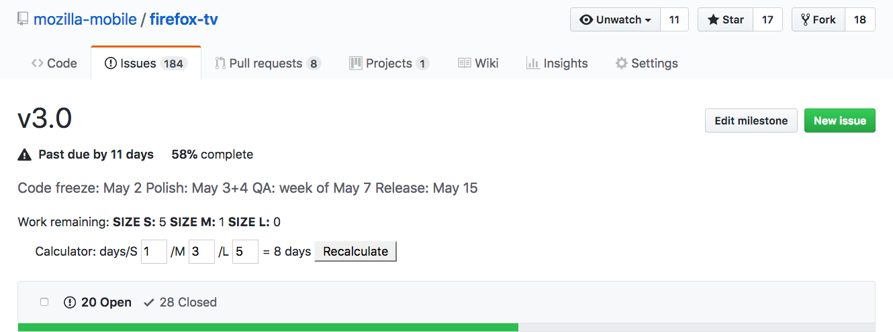

# Github Story Points
[Available on addons.mozilla.org][amo]

This add-on helps solve the problem of, "How many days will it take to complete this milestone?"



## Usage
To use this add-on, you'll first need to estimate, in days, how long it will take your team to complete each issue. Once you have an estimate, you should apply labels to each issue based on "T-shirt sizing": `size S` is an issue that can be fixed quickly, `size M` is larger, and `size L` is the largest.

These issues should then be compiled into a milestone (we represent each sprint with a milestone). Once your issues are estimated, labeled, and added to a milestone, open it ([here's an example][example]) and the values will be calculated automatically. Note that Closed issues are not counted.

These number of days to completion that each size label represents is configurable. By default, these labels represent:
- `size S` = <= 1 day to fix
- `size M` = 2-3 days to fix
- `size L` = 4-5 days to fix

And are calculated using their maximum values.

## Development
To develop, open the add-ons pane, select "Open a temporary add-on", and select the `manifest.json` file of this project.

To build for release, run:
```sh
./build.sh
```

which will write a file to `out/bundle.xpi`.

## License
The license included with this repository is based on the X11 license, which is similar to the MIT license.

[amo]: https://addons.mozilla.org/en-US/firefox/addon/github-story-points/
[example]: https://github.com/mcomella/Spoon-Knife/milestone/1
